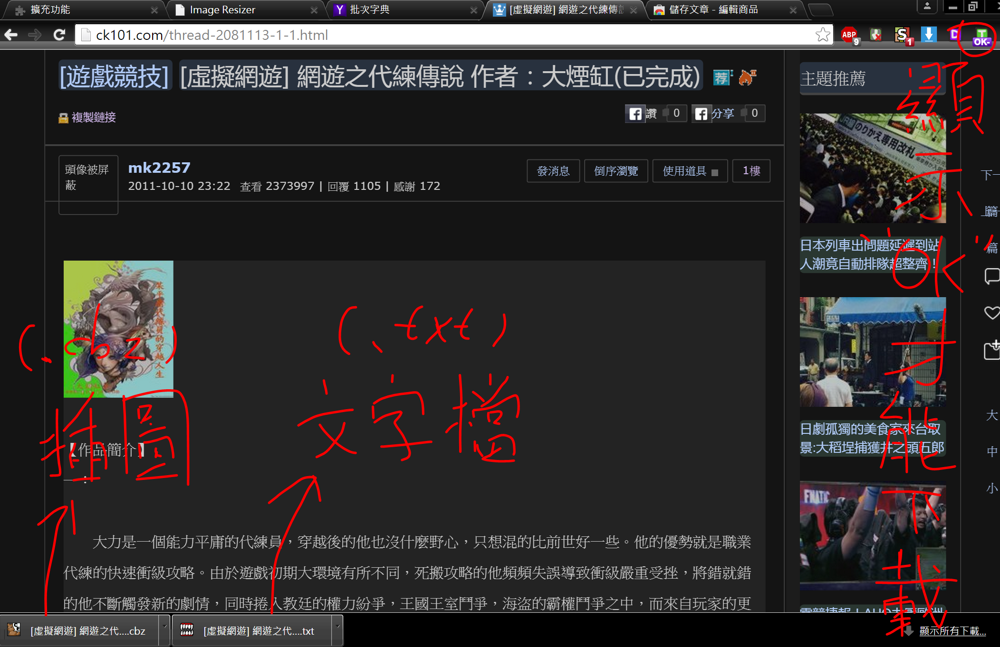

# Text Saver

- A Chrome extension which could store the text files from the web pages

## Running Environment

- Chrome browser

## Installation

- Chrome Store (http://tinyurl.com/p5egmk3)

## Development Environment

- Notepad++
- Chrome browser

## Extern Library

- JSZip (http://stuartk.com/jszip)

## License

- The MIT License (http://opensource.org/licenses/MIT)

